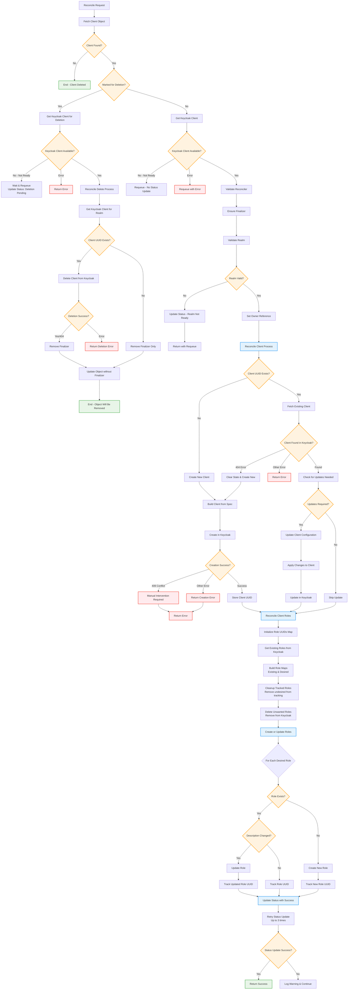

```mermaid
flowchart TD
    A[Reconcile Request] --> B[Fetch Client Object]
    B --> C{Client Found?}
    C -->|No| D[End - Client Deleted]
    C -->|Yes| E{Marked for Deletion?}
    
    E -->|Yes| F[Get Keycloak Client for Deletion]
    F --> G{Keycloak Client Available?}
    G -->|No - Not Ready| H[Wait & Requeue<br/>Update Status: Deletion Pending]
    G -->|Error| I[Return Error]
    G -->|Yes| J[Reconcile Delete Process]
    
    E -->|No| K[Get Keycloak Client]
    K --> L{Keycloak Client Available?}
    L -->|No - Not Ready| M[Requeue - No Status Update]
    L -->|Error| N[Requeue with Error]
    L -->|Yes| O[Validate Reconciler]
    
    O --> P[Ensure Finalizer]
    P --> Q[Validate Realm]
    Q --> R{Realm Valid?}
    R -->|No| S[Update Status - Realm Not Ready]
    R -->|Yes| T[Set Owner Reference]
    
    T --> U[Reconcile Client Process]
    
    %% Reconcile Client Process Details
    U --> V{Client UUID Exists?}
    V -->|No| W[Create New Client]
    V -->|Yes| X[Fetch Existing Client]
    
    X --> Y{Client Found in Keycloak?}
    Y -->|404 Error| Z[Clear State & Create New]
    Y -->|Other Error| AA[Return Error]
    Y -->|Found| BB[Check for Updates Needed]
    
    BB --> CC{Updates Required?}
    CC -->|Yes| DD[Update Client Configuration]
    CC -->|No| EE[Skip Update]
    
    W --> FF[Build Client from Spec]
    Z --> FF
    FF --> GG[Create in Keycloak]
    GG --> HH{Creation Success?}
    HH -->|409 Conflict| II[Manual Intervention Required]
    HH -->|Other Error| JJ[Return Creation Error]
    HH -->|Success| KK[Store Client UUID]
    
    DD --> LL[Apply Changes to Client]
    LL --> MM[Update in Keycloak]
    
    %% Role Reconciliation
    KK --> NN[Reconcile Client Roles]
    EE --> NN
    MM --> NN
    
    NN --> OO[Initialize Role UUIDs Map]
    OO --> PP[Get Existing Roles from Keycloak]
    PP --> QQ[Build Role Maps<br/>Existing & Desired]
    QQ --> RR[Cleanup Tracked Roles<br/>Remove undesired from tracking]
    RR --> SS[Delete Unwanted Roles<br/>Remove from Keycloak]
    SS --> TT[Create or Update Roles]
    
    TT --> UU{For Each Desired Role}
    UU --> VV{Role Exists?}
    VV -->|Yes| WW{Description Changed?}
    WW -->|Yes| XX[Update Role]
    WW -->|No| YY[Track Role UUID]
    VV -->|No| ZZ[Create New Role]
    
    XX --> AAA[Track Updated Role UUID]
    ZZ --> BBB[Track New Role UUID]
    
    %% Status Update Process
    YY --> CCC[Update Status with Success]
    AAA --> CCC
    BBB --> CCC
    
    CCC --> DDD[Retry Status Update<br/>Up to 3 times]
    DDD --> EEE{Status Update Success?}
    EEE -->|Yes| FFF[Return Success]
    EEE -->|No| GGG[Log Warning & Continue]
    
    %% Error Paths
    S --> HHH[Return with Requeue]
    II --> III[Return Error]
    JJ --> III
    
    %% Deletion Process Details
    J --> JJJ[Get Keycloak Client for Realm]
    JJJ --> KKK{Client UUID Exists?}
    KKK -->|Yes| LLL[Delete Client from Keycloak]
    KKK -->|No| MMM[Remove Finalizer Only]
    LLL --> NNN{Deletion Success?}
    NNN -->|Yes/404| OOO[Remove Finalizer]
    NNN -->|Error| PPP[Return Deletion Error]
    
    OOO --> QQQ[Update Object without Finalizer]
    MMM --> QQQ
    QQQ --> RRR[End - Object Will Be Removed]
    
    %% Styling
    classDef errorNode fill:#ffebee,stroke:#f44336,stroke-width:2px
    classDef successNode fill:#e8f5e8,stroke:#4caf50,stroke-width:2px
    classDef processNode fill:#e3f2fd,stroke:#2196f3,stroke-width:2px
    classDef decisionNode fill:#fff3e0,stroke:#ff9800,stroke-width:2px
    
    class I,N,AA,II,JJ,III,PPP errorNode
    class D,FFF,RRR successNode
    class U,NN,TT,CCC processNode
    class C,E,G,L,R,V,Y,CC,HH,VV,WW,EEE,KKK,NNN decisionNode
```