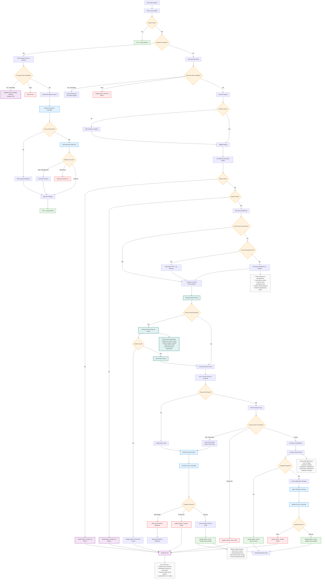

```mermaid
flowchart TD
    A[Reconcile Request] --> B[Fetch Group Object]
    B --> C{Group Found?}
    C -->|No| D[End - Group Deleted]
    C -->|Yes| E{Marked for Deletion?}
    
    %% Deletion Flow
    E -->|Yes| F[Get Keycloak Client for Deletion]
    F --> G{Keycloak Client Available?}
    G -->|No - Not Ready| H[Update Status: Deletion Pending<br/>Requeue 10s]
    G -->|Error| I[Return Error]
    G -->|Yes| J[Reconcile Delete Process]
    
    %% Main Reconciliation Flow
    E -->|No| K[Get Keycloak Client]
    K --> L{Keycloak Client Available?}
    L -->|No - Not Ready| M[Log & Requeue 5s<br/>No Status Update]
    L -->|Error| N[Update Status with Error<br/>Return]
    L -->|Yes| O[Ensure Finalizer]
    
    O --> P{Finalizer Exists?}
    P -->|No| Q[Add Finalizer & Update]
    P -->|Yes| R[Validate Realm]
    Q --> R
    
    %% Realm Validation
    R --> S[Get Referenced Realm Object]
    S --> T{Realm exists?}
    T -->|No| U[Update Status: Realm Not Found]
    T -->|Yes| V{Realm Ready?}
    V -->|No| W[Update Status: Realm Not Ready]
    V -->|Yes| X[Set Owner Reference]
    
    %% Owner Reference
    X --> Y{Correct Owner Ref Exists?}
    Y -->|Yes| Z[Continue to Group Reconciliation]
    Y -->|No| AA{Cross-Namespace Ref?}
    AA -->|Yes| BB[Skip Owner Ref - Log Warning]
    AA -->|No| CC[Set Owner Reference & Update]
    BB --> Z
    CC --> Z
    
    %% Main Group Reconciliation
    Z --> DD[Resolve Parent Group]
    DD --> EE{Parent Group Required?}
    EE -->|Yes| FF[Lookup Parent Group by Name]
    FF --> GG{Parent Found?}
    GG -->|No| HH[Update Status: Parent Not Found]
    GG -->|Yes| II[Store Parent UUID]
    EE -->|No| JJ[Continue without Parent]
    II --> JJ
    JJ --> KK[Get or Create Group in Keycloak]
    
    %% Group Creation/Update Logic
    KK --> LL{Group UUID Exists?}
    LL -->|No| MM[Create New Group]
    LL -->|Yes| NN[Fetch Existing Group]
    
    %% Fetch Existing Group
    NN --> OO{Group Found in Keycloak?}
    OO -->|404 - Not Found| PP[Clear Group State<br/>Create New Group]
    OO -->|Other Error| QQ[Update Status: Fetch Failed]
    OO -->|Found| RR[Compare Configuration]
    
    %% Create New Group
    MM --> SS[Build Group from Spec]
    PP --> SS
    SS --> TT[Create Group in Keycloak]
    TT --> UU{Creation Success?}
    UU -->|409 Conflict| VV[Manual Intervention Required]
    UU -->|Other Error| WW[Update Status: Creation Failed]
    UU -->|Success| XX[Fetch and Store Group UUID]
    XX --> YY[Update Status: Group Created Successfully]
    
    %% Configuration Comparison
    RR --> ZZ[Compare Group Fields]
    ZZ --> BBB{Changes Detected?}
    BBB -->|No| CCC[Update Status: Group Synchronized]
    BBB -->|Yes| DDD[Log Configuration Changes]
    
    %% Update Group
    DDD --> EEE[Apply Changes to Group]
    EEE --> FFF[Update Group in Keycloak]
    FFF --> GGG{Update Success?}
    GGG -->|Error| HHH[Update Status: Update Failed]
    GGG -->|Success| III[Update Status: Group Updated Successfully]
    
    %% Status Management
    YY --> JJJ[Schedule Requeue 30s]
    CCC --> JJJ
    III --> JJJ
    
    %% Error Handling with Requeue
    U --> KKK[Requeue 10s]
    W --> KKK
    HH --> KKK
    QQ --> KKK
    WW --> KKK
    HHH --> KKK
    VV --> LLL[Manual Resolution Required]
    
    %% Deletion Process Details
    J --> MMM[Delete Group from Keycloak]
    MMM --> NNN{Group UUID Exists?}
    NNN -->|No| OOO[Skip Keycloak Deletion]
    NNN -->|Yes| PPP[Call Keycloak Delete API]
    PPP --> QQQ{Deletion Success?}
    QQQ -->|404 - Already Gone| RRR[Consider Success]
    QQQ -->|Other Error| SSS[Requeue Deletion 5s]
    QQQ -->|Success| TTT[Remove Finalizer]
    OOO --> TTT
    RRR --> TTT
    TTT --> UUU[End - Group Deleted]
    
    %% Configuration Diff Details
    ZZ --> VVV[Check Field Differences:<br/>• name changes<br/>• parentId changes<br/>• realmRoles modifications<br/>• clientRoles modifications<br/>• attributes changes]
    
    %% Parent Resolution Details
    FF --> WWW[Parent Group Resolution:<br/>• Search by name in realm<br/>• Handle multiple matches<br/>• Store parent UUID<br/>• Set hierarchical relationship]
    
    %% Status Update Retry Logic
    YY --> XXX[Status Update Process:<br/>• Retry up to 3 times<br/>• Exponential backoff<br/>• Fetch latest before update<br/>• Preserve operational data]
    
    %% Owner Reference Logic
    CC --> YYY[Owner Reference Management:<br/>• Set realm as owner<br/>• Prevent cross-namespace refs<br/>• Enable cascade deletion<br/>• Maintain dependency graph]
    
    %% Error Recovery Strategies
    KKK --> ZZZ[Error Recovery:<br/>• Different retry intervals<br/>• Distinguish transient vs permanent<br/>• Preserve state during failures<br/>• Log detailed error context]
    
    %% Styling
    classDef errorNode fill:#ffebee,stroke:#f44336,stroke-width:2px
    classDef successNode fill:#e8f5e8,stroke:#4caf50,stroke-width:2px
    classDef processNode fill:#e3f2fd,stroke:#2196f3,stroke-width:2px
    classDef decisionNode fill:#fff3e0,stroke:#ff9800,stroke-width:2px
    classDef statusNode fill:#f3e5f5,stroke:#9c27b0,stroke-width:2px
    classDef parentNode fill:#e0f2f1,stroke:#00695c,stroke-width:2px
    classDef detailNode fill:#fafafa,stroke:#616161,stroke-width:1px
    
    class I,N,QQ,WW,HHH,VV,SSS errorNode
    class D,UUU,YY,CCC,III successNode
    class SS,TT,EEE,FFF,MMM,PPP processNode
    class C,E,G,L,P,T,V,Y,AA,EE,GG,LL,OO,UU,BBB,GGG,NNN,QQQ decisionNode
    class U,W,H,KKK statusNode
    class DD,FF,II,WWW parentNode
    class VVV,XXX,YYY,ZZZ detailNode
```