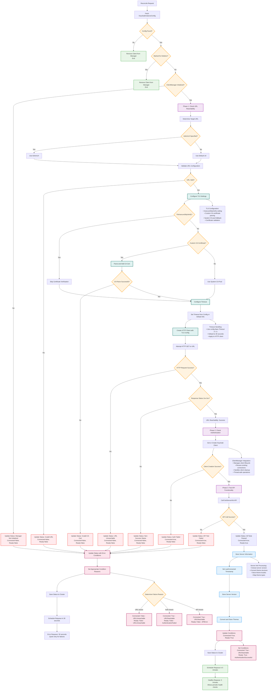

```mermaid
flowchart TD
    A[Reconcile Request] --> B[Fetch KeycloakInstanceConfig]
    B --> C{Config Found?}
    C -->|No| D[Remove Client from Manager<br/>End]
    C -->|Yes| E{Marked for Deletion?}
    
    %% Deletion Flow
    E -->|Yes| F[Remove Client from Manager<br/>End]
    
    %% Validation Flow
    E -->|No| G{ClientManager Initialized?}
    G -->|No| H[Update Status: Manager Not Initialized<br/>Connected=false, Ready=false]
    
    %% Phase 1: URL Reachability Check
    G -->|Yes| I[Phase 1: Check URL Reachability]
    I --> J[Determine Target URL]
    J --> K{AdminUrl Specified?}
    K -->|Yes| L[Use AdminUrl]
    K -->|No| M[Use Default Url]
    L --> N[Validate URL Configuration]
    M --> N
    
    N --> O{URL Valid?}
    O -->|No| P[Update Status: Invalid URL<br/>Connected=false, Ready=false]
    
    %% TLS Configuration
    O -->|Yes| Q[Configure TLS Settings]
    Q --> R{TlsInsecureSkipVerify?}
    R -->|Yes| S[Skip Certificate Verification]
    R -->|No| T{Custom CA Certificate?}
    T -->|Yes| U[Parse and Add CA Cert]
    T -->|No| V[Use System CA Pool]
    U --> W{CA Parse Successful?}
    W -->|No| X[Update Status: Invalid CA Cert<br/>Connected=false, Ready=false]
    W -->|Yes| Y[Configure Timeout]
    S --> Y
    V --> Y
    
    %% HTTP Connection Test
    Y --> Z[Set Timeout from Config or Default 30s]
    Z --> AA[Create HTTP Client with TLS Config]
    AA --> BB[Attempt HTTP GET to URL]
    BB --> CC{HTTP Request Success?}
    CC -->|No| DD[Update Status: URL Unreachable<br/>Connected=false, Ready=false]
    CC -->|Yes| EE{Response Status 2xx-3xx?}
    EE -->|No| FF[Update Status: Non-Success Status<br/>Connected=false, Ready=false]
    EE -->|Yes| GG[URL Reachability: Success]
    
    %% Phase 2: Authentication Check
    GG --> HH[Phase 2: Check Authentication]
    HH --> II[Get or Create Keycloak Client]
    II --> JJ{Client Creation Success?}
    JJ -->|No| KK[Update Status: Auth Failed<br/>Connected=true, Ready=false]
    
    %% Phase 3: API Functionality Test
    JJ -->|Yes| LL[Phase 3: Test API Functionality]
    LL --> MM[Call GetServerInfo API]
    MM --> NN{API Call Success?}
    NN -->|No| OO[Update Status: API Test Failed<br/>Connected=true, Ready=false]
    NN -->|Yes| PP[Update Status: All Tests Passed<br/>Connected=true, Ready=true]
    
    %% Status Update Process
    PP --> QQ[Store Server Information]
    QQ --> RR[Set LastConnected Timestamp]
    RR --> SS[Store Server Version]
    SS --> TT[Convert and Store Themes]
    TT --> UU[Update Conditions: Connected=True, Ready=True]
    UU --> VV[Save Status to Cluster]
    VV --> WW[Schedule Requeue in 5 minutes]
    
    %% Error Status Updates
    H --> XX[Update Status with Error Conditions]
    P --> XX
    X --> XX
    DD --> XX
    FF --> XX
    KK --> XX
    OO --> XX
    
    XX --> YY[Set Appropriate Condition Reasons]
    YY --> ZZ[Save Status to Cluster]
    ZZ --> AAA[Schedule Requeue in 30 seconds]
    
    %% Condition Details
    UU --> BBB[Set Conditions:<br/>Connected: True - URLReachable<br/>Ready: True - AuthenticationSuccessful]
    
    YY --> CCC{Determine Failure Reason}
    CCC -->|URL Issues| DDD[Connected: False - URLUnreachable<br/>Ready: False - URLUnreachable]
    CCC -->|Auth Issues| EEE[Connected: True - URLReachable<br/>Ready: False - AuthenticationFailed]
    CCC -->|API Issues| FFF[Connected: True - URLReachable<br/>Ready: False - APIError]
    
    %% TLS Configuration Details
    Q --> GGG[TLS Configuration:<br/>• InsecureSkipVerify setting<br/>• Custom CA certificate parsing<br/>• System CA pool fallback<br/>• Certificate validation]
    
    %% Server Info Processing
    QQ --> HHH[Server Info Processing:<br/>• Extract server version<br/>• Convert theme structure<br/>• Store theme locales<br/>• Map theme types]
    
    %% Timeout Configuration
    Z --> III[Timeout Handling:<br/>• Use config.Spec.Timeout if > 0<br/>• Default to 30 seconds<br/>• Apply to HTTP client]
    
    %% Requeue Strategy
    WW --> JJJ[Healthy Requeue: 5 minutes<br/>Allows periodic health checks]
    AAA --> KKK[Error Requeue: 30 seconds<br/>Quick retry for failures]
    
    %% Client Manager Integration
    II --> LLL[ClientManager Integration:<br/>• Manages client lifecycle<br/>• Reuses existing connections<br/>• Handles client cleanup<br/>• Thread-safe operations]
    
    %% Styling
    classDef errorNode fill:#ffebee,stroke:#f44336,stroke-width:2px
    classDef successNode fill:#e8f5e8,stroke:#4caf50,stroke-width:2px
    classDef processNode fill:#e3f2fd,stroke:#2196f3,stroke-width:2px
    classDef decisionNode fill:#fff3e0,stroke:#ff9800,stroke-width:2px
    classDef phaseNode fill:#f3e5f5,stroke:#9c27b0,stroke-width:2px
    classDef tlsNode fill:#e0f2f1,stroke:#00695c,stroke-width:2px
    classDef statusNode fill:#fce4ec,stroke:#ad1457,stroke-width:2px
    
    class H,P,X,DD,FF,KK,OO errorNode
    class D,F,WW,JJJ successNode
    class I,HH,LL,QQ,RR,SS,TT processNode
    class C,E,G,K,O,R,T,W,CC,EE,JJ,NN,CCC decisionNode
    class I,HH,LL phaseNode
    class Q,U,Y,AA tlsNode
    class UU,XX,YY,BBB,DDD,EEE,FFF statusNode

```