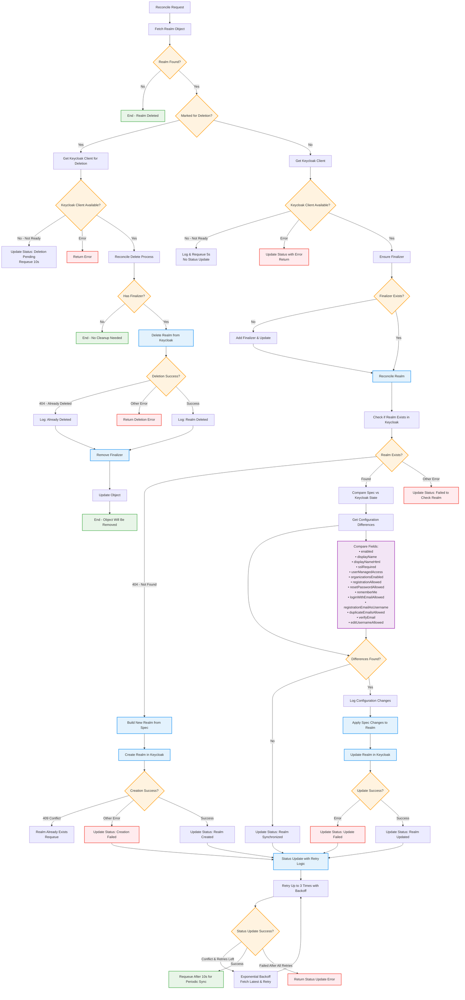

```mermaid
flowchart TD
    A[Reconcile Request] --> B[Fetch Realm Object]
    B --> C{Realm Found?}
    C -->|No| D[End - Realm Deleted]
    C -->|Yes| E{Marked for Deletion?}
    
    %% Deletion Flow
    E -->|Yes| F[Get Keycloak Client for Deletion]
    F --> G{Keycloak Client Available?}
    G -->|No - Not Ready| H[Update Status: Deletion Pending<br/>Requeue 10s]
    G -->|Error| I[Return Error]
    G -->|Yes| J[Reconcile Delete Process]
    
    %% Main Reconciliation Flow
    E -->|No| K[Get Keycloak Client]
    K --> L{Keycloak Client Available?}
    L -->|No - Not Ready| M[Log & Requeue 5s<br/>No Status Update]
    L -->|Error| N[Update Status with Error<br/>Return]
    L -->|Yes| O[Ensure Finalizer]
    
    O --> P{Finalizer Exists?}
    P -->|No| Q[Add Finalizer & Update]
    P -->|Yes| R[Reconcile Realm]
    Q --> R
    
    %% Realm Reconciliation Details
    R --> S[Check if Realm Exists in Keycloak]
    S --> T{Realm Exists?}
    
    %% Realm Creation Flow
    T -->|404 - Not Found| U[Build New Realm from Spec]
    U --> V[Create Realm in Keycloak]
    V --> W{Creation Success?}
    W -->|409 Conflict| X[Realm Already Exists<br/>Requeue]
    W -->|Other Error| Y[Update Status: Creation Failed]
    W -->|Success| Z[Update Status: Realm Created]
    
    %% Realm Update Flow
    T -->|Found| AA[Compare Spec vs Keycloak State]
    AA --> BB[Get Configuration Differences]
    BB --> CC{Differences Found?}
    
    CC -->|No| DD[Update Status: Realm Synchronized]
    CC -->|Yes| EE[Log Configuration Changes]
    EE --> FF[Apply Spec Changes to Realm]
    FF --> GG[Update Realm in Keycloak]
    GG --> HH{Update Success?}
    HH -->|Error| II[Update Status: Update Failed]
    HH -->|Success| JJ[Update Status: Realm Updated]
    
    %% Get Differences Details
    BB --> KK[Compare Fields:<br/>• enabled<br/>• displayName<br/>• displayNameHtml<br/>• sslRequired<br/>• userManagedAccess<br/>• organizationsEnabled<br/>• registrationAllowed<br/>• resetPasswordAllowed<br/>• rememberMe<br/>• loginWithEmailAllowed<br/>• registrationEmailAsUsername<br/>• duplicateEmailsAllowed<br/>• verifyEmail<br/>• editUsernameAllowed]
    KK --> CC
    
    %% Deletion Process Details
    J --> LL{Has Finalizer?}
    LL -->|No| MM[End - No Cleanup Needed]
    LL -->|Yes| NN[Delete Realm from Keycloak]
    NN --> OO{Deletion Success?}
    OO -->|404 - Already Deleted| PP[Log: Already Deleted]
    OO -->|Other Error| QQ[Return Deletion Error]
    OO -->|Success| RR[Log: Realm Deleted]
    
    PP --> SS[Remove Finalizer]
    RR --> SS
    SS --> TT[Update Object]
    TT --> UU[End - Object Will Be Removed]
    
    %% Status Update Process
    Z --> VV[Status Update with Retry Logic]
    DD --> VV
    JJ --> VV
    Y --> VV
    II --> VV
    
    VV --> WW[Retry Up to 3 Times with Backoff]
    WW --> XX{Status Update Success?}
    XX -->|Conflict & Retries Left| YY[Exponential Backoff<br/>Fetch Latest & Retry]
    XX -->|Success| ZZ[Requeue After 10s for Periodic Sync]
    XX -->|Failed After All Retries| AAA[Return Status Update Error]
    
    YY --> WW
    
    %% Error Handling
    T -->|Other Error| BBB[Update Status: Failed to Check Realm]
    
    %% Styling
    classDef errorNode fill:#ffebee,stroke:#f44336,stroke-width:2px
    classDef successNode fill:#e8f5e8,stroke:#4caf50,stroke-width:2px
    classDef processNode fill:#e3f2fd,stroke:#2196f3,stroke-width:2px
    classDef decisionNode fill:#fff3e0,stroke:#ff9800,stroke-width:2px
    classDef configNode fill:#f3e5f5,stroke:#9c27b0,stroke-width:2px
    
    class I,N,QQ,Y,II,BBB,AAA errorNode
    class D,MM,UU,ZZ successNode
    class R,U,V,FF,GG,NN,SS,VV processNode
    class C,E,G,L,P,T,W,CC,HH,LL,OO,XX decisionNode
    class KK configNode
```